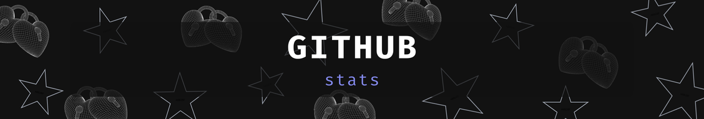
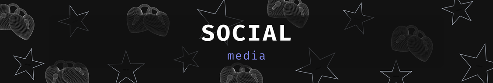

# About me:
>
> :computer: Software Developer with ability to learn and collaborate in rapidly changing environments and compositions. Passion for tackling web development/design challenges to achieve lasting impacts on user experience.
>  
>  
> :triangular_flag_on_post: From Brazil - São Paulo
>  
>  
> :books: Fluent in English and Portuguese.
>

  

  

 

  

  

<table>
  <tr>
    <td>
      
    </td>
    <td>
      
    </td>
  </tr>
</table> 

  

  
  

